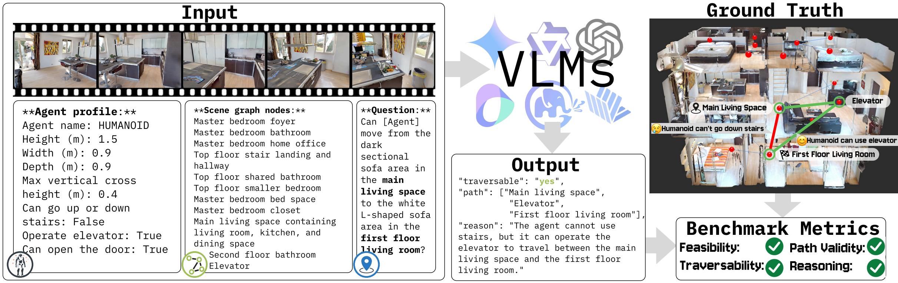
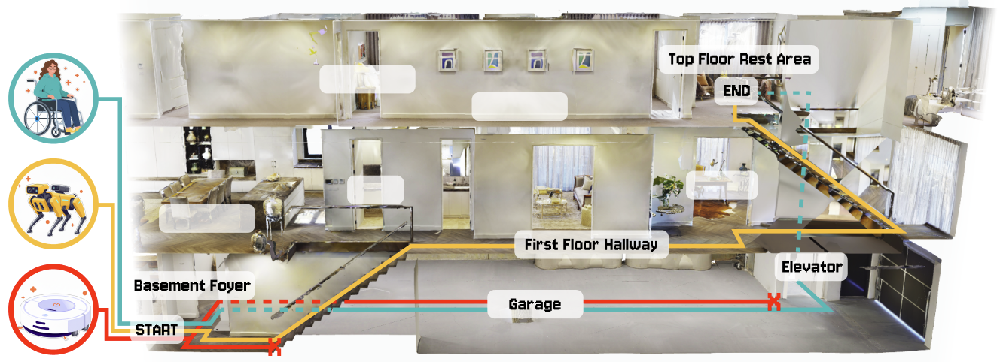
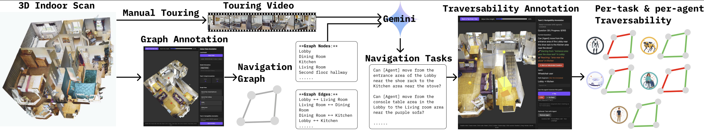
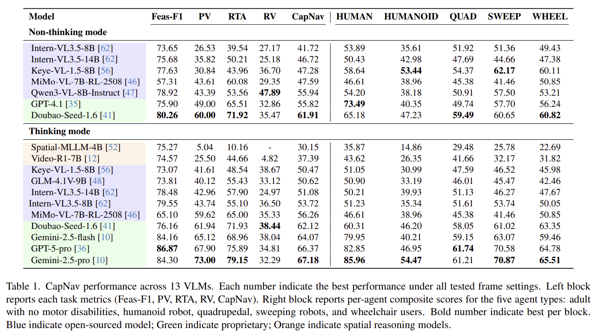

<div align="center">

# ✨CapNav: Benchmarking Vision Language Models on Capability-conditioned Indoor Navigation✨

<p align="center">
    <a href="https://xiasu.github.io/">Xia Su</a><sup>1*</sup>,
    <a href="https://ruiqi-chen-0216.github.io/">Ruiqi Chen</a><sup>1*</sup>,
    <a href="https://liubl1217.github.io/">Benlin Liu</a><sup>1</sup>,
    <a href="https://jingweim.github.io/">Jingwei Ma</a><sup>1</sup>,
    <a href="https://scholar.google.com/citations?user=5lFDxsMAAAAJ&hl=en">Zonglin Di</a><sup>2</sup>,
    <a href="https://ranjaykrishna.com/index.html">Ranjay Krishna</a><sup>1</sup>,
    <a href="https://jonfroehlich.github.io/">Jon E. Froehlich</a><sup>1</sup>,
    <br>
    <sup>*</sup>Equal Contribution.
    <br>
    <sup>1</sup>University of Washington,
    <sup>2</sup>University of California, Santa Cruz
</p>

<!-- 
<a href='https://arxiv.org/abs/2505.23747'></a> &nbsp;&nbsp;&nbsp;&nbsp;
<a href='https://diankun-wu.github.io/Spatial-MLLM/'></a> &nbsp;&nbsp;&nbsp;&nbsp;
<a></a> &nbsp;&nbsp;&nbsp;&nbsp;
-->




</div>
<strong>Capability-Conditioned Navigation (CapNav):</strong> We introduce Capability-Conditioned Navigation (<em><strong>CapNav</strong></em>), a benchmark designed to evaluate how well vision–language models (VLMs) can navigate complex indoor environments given an agent’s specific physical and operational capabilities. As illustrated, CapNav takes as input (1) a tour video of an indoor space, (2) nodes of its navigation graph, (3) an agent’s mobility profile, and (4) a navigation task, and evaluates model outputs along multiple dimensions, including task feasibility, path validity, route traversability, and reasoning validity.
</div>


## 🌟 Overview



</div>

The CapNav benchmark evaluates whether VLMs can correctly ground differences in agent mobility capabilities when generating navigation plans. This example demonstrates a navigation task that has different feasibility and path for different agents.




</div>
Overview of CapNav's data construction: Starting from a 3D indoor scan, we manually record a touring video and a navigation graph. We then use Gemini to generate natural language navigation tasks. Finally, per-task and per-agent traversability are annotated by manually controlling agents in the annotation interface.


## 🎉 Performance



## 📦 Dataset

The CapNav benchmark dataset is **not included** in this repository.

All dataset contents are hosted externally:

- [**Hugging Face**](https://huggingface.co/datasets/RichardC0216/CapNav)  
  Structured benchmark data (navigation questions, agent profiles, scene metadata)  

- [**Google Drive**](https://drive.google.com/drive/folders/1NUAE02OPMaf3GnMfXHnuZNktk8cotD4u?usp=sharing)  
  Touring videos of indoor environments  
  (including raw videos and a processed 64-frame @ 1 FPS version for open-source models)

> Note:  
> This repository contains evaluation code and utilities only.  
> Please download the dataset from the links above before running any experiments.


## ⚙️ Setup

### 1. Clone Repository
```bash
git clone https://github.com/Ruiqi-Chen-0216/CapNav
cd CapNav
```

### 2. Environment Setup

1. **Create conda environment:**

```bash
conda create -n CapNav python=3.10 -y
conda activate CapNav
```

2. **Install dependencies**
```bash
pip install torch torchvision torchaudio
pip install transformers
pip install einops timm
pip install decord
pip install accelerate
pip install av
pip install tiktoken
```
> **Optional:**  
> For convenience, you may use the provided setup script to install dependencies:
> 
> ```bash
> bash setup_opensourced.sh
> ```
> 
> The script performs the same steps as above and does not modify system-level
> configurations or cache locations.


## 🧪 Evaluation

### 1. Data Preparation

Before running any evaluation, you need to prepare the CapNav dataset
and generate capability-conditioned prompts.

#### Download Dataset

The CapNav dataset is hosted on Hugging Face.
The following command downloads a complete snapshot of the dataset repository,
including the benchmark parquet files, agent profiles, and full ground-truth annotations.

```bash
hf download RichardC0216/CapNav \
  --repo-type dataset \
  --local-dir data/CapNav \
  --resume-download
```
Video data should be downloaded separately from [Google Drive](https://drive.google.com/drive/folders/1NUAE02OPMaf3GnMfXHnuZNktk8cotD4u?usp=sharing).

#### Prompt Generation

CapNav evaluates models using capability-conditioned navigation prompts.
We provide scripts to generate prompts by combining:

- Navigation questions
- Agent profiles
- Scene graph nodes

To generate prompts:

```bash
python scripts/generate_prompts.py 
```

### 2. Evaluation on Open-source Vision–Language Models

We evaluate open-source vision–language models (VLMs) using **preprocessed videos**
sampled to **64 frames at 1 FPS** by default, in order to ensure consistent input length
and fair comparison across models.

All open-source models are evaluated using the same CapNav prompts,
agent profiles, and scene information.

---

#### Running Evaluation

Evaluation is performed via a unified entry script:

```bash
python scripts/run.py [ARGS]
```

---

#### Quick Sample Run (≈200 Questions)

For quick sanity checks, debugging, or low-resource environments,
we provide a lightweight evaluation script:

```bash
python scripts/run_sample.py [ARGS]
```

This script evaluates a curated subset of scenes
(~200 capability-conditioned prompts) instead of the full benchmark.

Example:
```bash
python scripts/run_sample.py \
  --model InternVL3_5-8B \
  --num_frames 32 \
  --thinking on
```

---
CapNav supports two evaluation modes, depending on how model weights
are provided.

#### Mode A (Default): Hugging Face Models (Auto Download)

This is the **recommended and default mode**.

If `--model` is a valid Hugging Face repository id (or an allowed short name),
model weights will be:

- automatically downloaded on first use via `transformers.from_pretrained`
- cached in the Hugging Face cache directory

```bash
python scripts/run.py \
  --model InternVL3_5-8B \
  --num_frames 32 \
  --thinking on
```

**Arguments:**

- `--model`  
  Hugging Face model id (strictly validated; see error message if invalid).
- `--num_frames`  
  Number of video frames used as model input.  
  Typical values include `16`, `32`, or `64`, depending on the model’s input capacity
  and available GPU memory.
- `--thinking`  
  Whether to enable internal reasoning mechanisms, if supported by the model.
  Options: `on` or `off`.
 
> The exact set of supported models and valid `--thinking` modes
> is enforced by `scripts/run.py` to avoid silent misconfiguration.


#### Mode B (Advanced): Local Checkpoints (No Download)

If you have already downloaded model checkpoints locally
(e.g., shared filesystem or offline environment),
you can bypass Hugging Face downloads by providing a local path.

In this case, you must also specify `--backend` to explicitly select the corresponding adapter.

```bash
python scripts/run.py \
  --model InternVL3_5-8B \
  --model_path /path/to/local/InternVL3_5-8B \
  --backend internvl \
  --num_frames 32 \
  --thinking on
```

**Additional arguments:**

- `--model_path`  
  Path to a local checkpoint directory.
- `--backend`  
  Adapter name (`internvl`, `mimo`, `qwen3`, `glm`, `spatial_mllm`, `videor1`) 

When `--model_path` is provided: 
- No Hugging Face download is triggered
- All weights are loaded strictly from disk
- `--backend` is mandatory


#### Model Adapters

Each open-source vision–language model is associated with a corresponding
adapter located at:
```bash
src/model_adapters/<MODEL_NAME>_adapter.py
```
We provide adapters **only for the open-source VLMs evaluated in the paper**.
These adapters are intended to serve as **reference implementations**.
Users who wish to evaluate CapNav on additional open-source models can extend the
benchmark by implementing new adapters following the existing examples.

#### Model Weights: Hugging Face Cache vs. Local Checkpoints

By default, model weights are loaded via Hugging Face / Transformers
(`from_pretrained`). If `--model` is a Hugging Face repo id, weights will be
downloaded on first use and stored in the **Hugging Face cache**.

We recommend managing cache locations via a repo-root `.env` file (optional) or
direct environment variables:

- `HF_HOME` / `HF_HUB_CACHE` / `TRANSFORMERS_CACHE`: cache directories
- `HF_TOKEN`: for gated or restricted models

If you prefer to deploy checkpoints locally (e.g., shared filesystem / offline),
you can pass a local checkpoint directory via `--model_path`. In this case, the
code will load from disk and **will not trigger any downloads**.

(Optional offline mode)
- `HF_HUB_OFFLINE=1` and `TRANSFORMERS_OFFLINE=1`


---
#### Compute CapNav Metrics (Paper Scores)

After `run.py` finishes, CapNav saves per-prompt predictions under:

```
results/<model_setting>/<scene>/*.json
```

To reproduce the paper metrics (**F1**, **Path Validity (PV)**,  
**Route Traversability Accuracy (RTA)**, and **Reasoning Validity (RV)**), run:

```bash
python scripts/capnav_score.py
```

This will generate:

- `results/scored_per_record.jsonl`  
  → Per-question evaluation details (all metric components)

- `results/scored_summary.json`  
  → Aggregate metrics and final CapNav score


> **Note (RV requires an OpenAI API key).**  
> RV follows the paper’s *LLM-as-judge* protocol and requires an OpenAI API key.  
> Before running `score.py`, set:
>
> ```bash
> export OPENAI_API_KEY="YOUR_API_KEY"
> ```

### 3. Evaluation on Peer Spatial Reasoning Models

In addition to vision–language models, CapNav is evaluated on **peer spatial reasoning models**
that explicitly model temporal or spatial reasoning over videos.

These models are evaluated using the same CapNav prompts, agent profiles, and scene information.

Currently evaluated peer models include:
- Spatial-MLLM
- Video-R1

---

#### Spatial-MLLM

We evaluate Spatial-MLLM using its official implementation:

https://github.com/diankun-wu/Spatial-MLLM

All model architectures, checkpoints, and inference logic follow the original repository.
This project does **not** modify the model code.

##### Environment Setup

To simplify deployment, we provide a reference environment setup script:

```bash
source setup_spatialMLLM.sh
```

This script prepares a compatible runtime environment and is provided for convenience only.
Users may need to adjust environment parameters (e.g., CUDA version, GPU architecture)
based on their local setup.

For model-specific configuration and checkpoints, please refer to the original repository [Spatial-MLLM](https://github.com/diankun-wu/Spatial-MLLM).

Running Evaluation

After preparing the environment and CapNav prompts, run:
```bash
python scripts/run.py --model Diankun/Spatial-MLLM-subset-sft --num_frames 16 --thinking on
```

#### Video-R1

We evaluate Video-R1 using its official implementation:

https://github.com/tulerfeng/Video-R1

All model architectures, checkpoints, and inference logic follow the original repository.
This project does **not** modify the model code.

##### Environment Setup

To simplify deployment, we provide a reference environment setup script:

```bash
source setup_videor1.sh
```

This script prepares a compatible runtime environment and is provided for convenience only.
Users may need to adjust environment parameters (e.g., CUDA version, GPU architecture)
based on their local setup.

> **Note:**  
> Qwen2.5-VL has been frequently updated in the Transformers library, which may cause
> version-related bugs or inconsistencies.  
> The Video-R1 code is compatible with a specific version of Qwen2.5-VL.
> Please download the compatible version from
> [here](https://drive.google.com/file/d/1Kc81WZitEhUZYWXpL6y2GXuSXufLSYcF/view?usp=sharing) before run setup script.


For model-specific configuration and checkpoints, please refer to the original repository [Video-R1](https://github.com/tulerfeng/Video-R1).

Running Evaluation

After preparing the environment and CapNav prompts, run:
```bash
python scripts/run.py --model Video-R1/Video-R1-7B --num_frames 16 --thinking on
```

### 4. Evaluation on Proprietary Vision–Language Models

We evaluate proprietary vision–language models as part of our experimental analysis.
However, due to licensing restrictions and API access requirements, we do **not**
provide evaluation code for proprietary models in this repository.

Users who wish to evaluate CapNav on proprietary models should refer to the
official documentation provided by each model vendor and implement evaluation
pipelines accordingly.

Representative proprietary models evaluated in the paper include:
- Gemini
- GPT-series models
- Seed models

Please consult the corresponding official API documentation for:
- Model access and authentication
- Input formatting and request limits
- Pricing, usage policies, and rate limits

This repository provides the CapNav dataset, prompts, and evaluation protocol
required to reproduce the benchmark, but does not include proprietary API
wrappers or execution scripts.

## 🛠 Annotation & Benchmark Construction

CapNav was constructed using a multi-stage annotation pipeline,
including navigation graph labeling and per-agent traversability annotation.

We release the full annotation toolkit for reproducibility
and future benchmark extensions.

If you are interested in understanding or reproducing the
benchmark construction process, please refer to [annotator/README.md](annotator/README.md) for details.


## 📚  Citation

If you find it useful for your research and applications, please cite our paper using this BibTeX:
```bibtex
@article{su2025capnav,
    title={CapNav: Benchmarking Vision Language Models on Capability-conditioned Indoor Navigation},
    author={Su, Xia  and Chen, Ruiqi and Liu, Benlin and Ma, Jingwei and Di, Zonglin and Krishna, Ranjay and Froehlich, Jon},
    journal={arXiv preprint arXiv:xxxxxx},
    year={2025}
}
```

## Acknowledgements

Thanks to these great repositories: [Spatial-MLLM](https://github.com/diankun-wu/Spatial-MLLM), [Video-R1](https://github.com/tulerfeng/Video-R1), [Qwen2.5-VL](https://github.com/QwenLM/Qwen2.5-VL), and many other inspiring works in the community.

